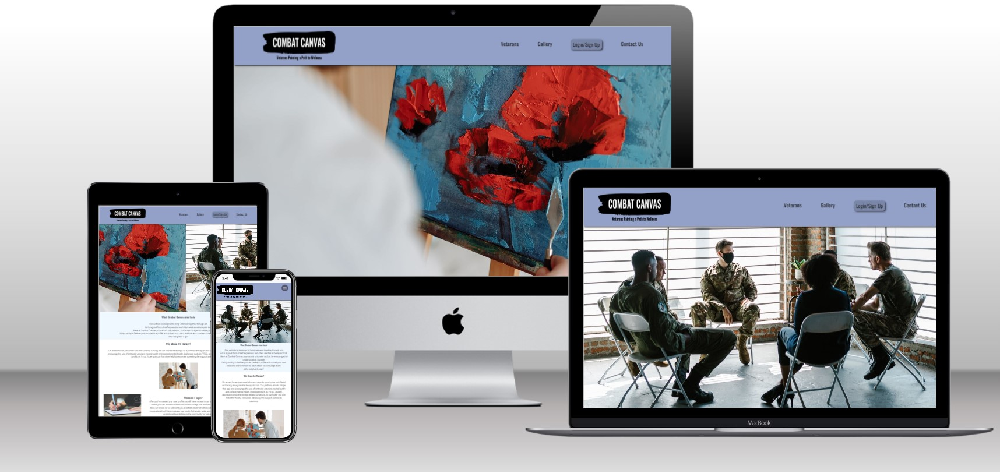
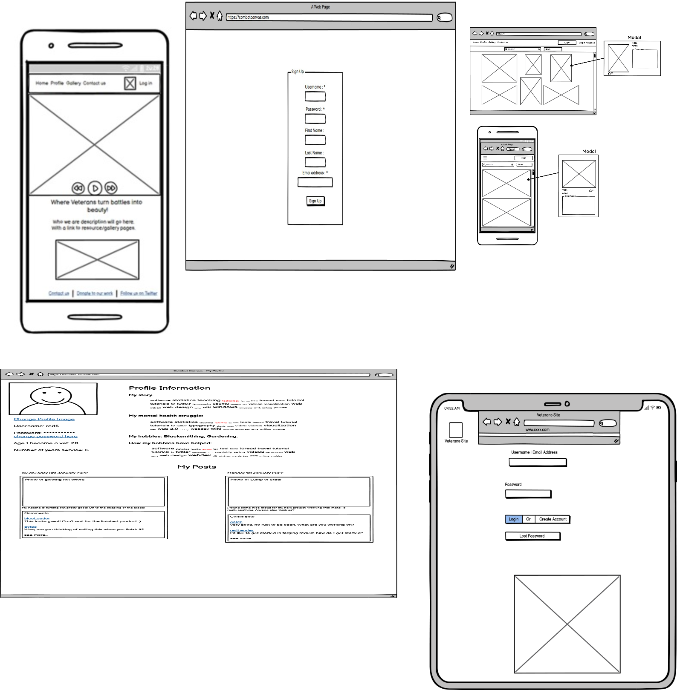

## **Hackathon Project No 3 - Art therapy gallery.**
**Team 6, Team Name : Piccadilly Pythons.**
---
## Project Name : Combat Canvas.

# **TABLE OF Contents**

* [**Project Brief**](#Project-Brief)

* [**User Experience** ](#UX)
    * [**User Stories**](#User-Stories)
    * [**Wireframe** ](#Wireframe)
    * [**Surface**](Surface)
    * [**Features** ](#Features)
   * [**Existing Features**](#Existing-Features)
   * [**Features Left to Implement**](#Features-Nice To Have)
   * [**Technologies Used**](#Technologies-Used)
    * [**Frameworks and libraries used in the project**](#Frameworks-and-libraries-used-in-the-project)
* [ **Testing**](#Testing)
* [ **Deployment**](#Deployment)
* [**Credits** ](#Credits)
    * [**Webpages** ](#Sites)
    * [ **Gallery Contents**](#Gallery)
 * [**Acknowledgements** ](#Acknowledgements)
 * [**Disclaimer Warning**](#Disclaimer-Warning)

---
# Project Demo Page

 
 

[**Project  Live Demo Page**](https://combat-canvas-production.up.railway.app/)

## Project Brief
Code Institute London Hackathon project in conjuction with SODA Social and in partnership with Ex-Military Careers.COM ,came up with the initiative *supporting Veterans Mental Health*.

My team has chosen *The ART THERAPY GALLERY:A platform where veterans can submit and showcase their creativity work*.
   we believe that mental health  awareness is vital amongst VETERANS , their is overbearing stigma surrounding mental health with lack of educationa resources and the  society so many are left aliented . This project is dedicated to  help create a space for veterans  to express themselves and hope this will help to reduce the sitgam and promote cathartic therapy that ART can offer.

  This project is  also an opportunity for CI students to brainstorm and also to use their coding skills to develop apps and websites to support the veterans activities such as Wellness tracker, Veterans stories and other Mental health resources.

 In preparing for this project we have conducted research on some veterans websites and also partictipated in the *SODA* webinar with some veterans at present. This gave us more insights on what to develop for the project. 

The team has created Art work of Gallery to show case the veterans work. We have used Django and Python programming skills to develop the webpages and incorporated CRUD functionality (Create,Read,Update and Delete). Team has worked in Sprints using Agile methodology to deliver the project.

## User Experience

In this section, We are going to provide insights into  UX process, mainly focusing on the ART THERAPY GALLERY  which is what this application is built for and  what it intent to achieve and how Veterans can best utilise this web application to fulfil their needs.

The webpage contents and functionality has been developed with user interface and aesthetics focus in mind based on the user type(Veterans).

According to Caglar Araz from UX Collective, User Experience (UX) is "User experience refers to the singular and accumulated experiences that occur for users as a consequence of them interacting with an object in a given context."

The planning and development of this project is divided into 5 planes:

1. The Strategy Plane
2. The Scope Plane
3. The Structure Plane
4. The Skeleton Plane
5. The Surface Plane

    ------------------
    ## **Strategy Plane**

### Creator Goals

- To create an interactive web application that is fully responsive on desktop to smaller devices such as mobile and Tablet

-  To create a website with interface design, presenting a logical structure allowing users(Veterans) to easily navigate.

# User Stories

-  As a veteran, i should be able to login, create and save profile picture  of myself so i can easily identify the authentcity of my page.

-  As a Veteran, I would like to navigate the art gallery to see the art 
    work.
 
- As Veteran, I should be able to navigate on all the links on the page  to see contents that might be of interest. 

-   As a Veteran, I should be able to use the site  to easily access resources and  help guidance.

- As a veteran  with no previous access to art therapy i should be able to 
  search for help  on the Combat Canvas page so i can get help with calming influence therapy.

- As a veteran struggling with loneliness, i should be able to use the  
  website to engage with new community to start a new hubby to improve my emotions.

- As an ex-military veteran with anger and depression, i should be able to  
  use the Combat Canvas page to search for services that can provide 
  rehabiliation sessions
 

## **Scope Plane**

-   A simple home page with responsive navigation bar to allow user to easily navigate without having to scroll and to show the purpose of the website.

-   Simple roadmap design that is visually appealing, non-distracting and easy to follow.

-   The design of the website should be visually consistent across all aspects to make it visually pleasing and comfortable for users.

-   The web application should be responsive across different resolutions.

## **Structure Plane**

---

1. Home

    - The Navbar is always fixed on top of the page with *COMBAT CANVAS logo* , the logo is on the left-hand side of the bar and a menu on the right with clear names of site pages for the ease of navigation. The carousel changes the images. This Navbar will stay consistent throughout the entire website and will automatically minimised into a hamburger menu on smaller devices.

    - The content of the home page contains the veterans pictures, and other contents they can navigate to.

    - A footer with social media links is featured at the bottom to allow users to easily connect with socials.

# Wireframes

 

We have created mockup screens of the webpage functionalities using Balsamic Software tool.
The initial draft of the wireframe was based on how user can navigate each page on the site however, the final product might be different due to team design thinking improvement.

 *Click link below to open wireframes* 

* [**Combat Canvas Home page**](https://github.com/daat2/Combat-Canvas/blob/main/static/wireframe/combat%20canvas%20homepage.png)

* [**Combat Canvas signup page**](https://github.com/daat2/Combat-Canvas/blob/main/static/wireframe/combat-canvas-signup.png)
* [**Combat Canvas Home page**](https://github.com/daat2/Combat-Canvas/blob/main/static/wireframe/combat%20canvas%20homepage.png)
* [**Gallery page**](https://github.com/daat2/Combat-Canvas/blob/main/static/wireframe/Gallery%20page%20.png)
* [**Desktop login  page**](https://github.com/daat2/Combat-Canvas/blob/main/static/wireframe/Login%20Page%20.png)
* [**Desktop Logout page**](https://github.com/daat2/Combat-Canvas/blob/main/static/wireframe/Mobile%20Logout.png)
* [**Mobile login page**](https://github.com/daat2/Combat-Canvas/blob/main/static/wireframe/Mobile%20Login.png)
* [**Mobile logout page**](https://github.com/daat2/Combat-Canvas/blob/main/static/wireframe/Mobile%20Logout.png)
* [**Veterans profile page**](https://github.com/daat2/Combat-Canvas/blob/main/static/wireframe/Veterans%20profile%20page%20.png)

## **Surface**

### Design

The website has been designed with a good user look and feel with minimal color distraction. All the fonts and styles are consistent throughout the site to make the users feel comfortable. With the help of CSS styles and media queries, the site is responsive across devices from desktop, laptop, tablet to mobile. Even on smaller devices, the contents are aligned proportionally and styled to make sure they are still legible and well-displayed. Altogether, the design and layout of the site should be entertaining and captivating so that a user is able to understand and enjoy the site.

### Typography

We have used Oswald Heavy fonts for headings and Merriweather  for Paragraph

The website is fully responsive across all devices with the help of CSS styling and media queries to custom font sizes (smaller for mobile devices) and styles to keep all the content in place and legible.

## Colour Scheme.

## Technologies Used

### Frameworks and libraries used
 * Django
 * Python 
 * CSS 
 * Html 
 * Google Fonts 

## Testing
-------------
Testing was done within the team.The purpose of testing is to verify no broken links and all navigation pages opens up.
 Also validated the user friendliness of the site to conform with user experience design.
All the functional requirements met the acceptance criteria set up by the team.

## Deployment

The working websites has been deployed  

# Deployment steps 

## Credits 

### We have acknowledge the sources below to credit their contents used. 

    **Website Sources with research topic links*.   

 [**PTSD**](  https://www.ptsd.va.gov/professional/assessment/documents/PCL5_Standard_form.PDF )    

[**Depression**](https://coepes.nih.gov/sites/default/files/2020-12/PHQ-9%20depression%20scale.pdf)

[**Anxiety**](https://www.ons.org/sites/default/files/2017-06/GeneralAnxiety7_English_0.pdf)

 [**Art Therapy**](   https://combatstress.org.uk/get-help/how-we-help/art-therapy)    

   [**Combat Stress**](https://www.youtube.com/watch?v=S4rKBUt1hEc)

  [**Soldiers battle PTSD with art**]( https://www.youtube.com/watch?v=zzyrqdHNBbs&t=135s )  

[**Where Veterans Unleash their Creative Firepower**](http://artilleryartistry.com/)  

[**Celebrating Veterans' Artistic Valor**](http://paintingpatriots.com/)

# Gallery Contents

[**RODNAE Productions**](https://www.pexels.com/photo/photo-of-people-talking-to-one-another-7468257/)

[**Thirdman**](	https://www.pexels.com/photo/man-painting-on-a-canvas-6732656/)

[**Los Muertos Crew**](https://www.pexels.com/photo/man-people-woman-construction-8447782/)

[**Quang Nguyen Vinh**]( https://www.pexels.com/photo/person-molding-brown-clay-2162943/ )

[**picjumbo.com**]( https://www.pexels.com/photo/person-holding-blue-ballpoint-pen-writing-in-notebook-210661/)

## Acknowledgments 

Shout to all the team *Team 6- Picadilly Pythons*.The team has been incredible hard working within the short period of time. 
Thank you to Team.
Members of the team: 

Patrick Pereira Vieira,
Tindy Chan
Lydia Young
Ibi
Alex Doherty
Vasile Tios Tsimourdagkas 
Ant

We acknowledge SODA and all the Code institute staff on site for the London April Hackathon for their support on site.

## Disclaimer 
All resources used for this project are intended for Academic purposes ony.